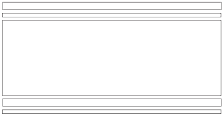
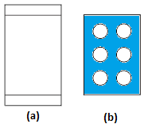
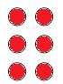
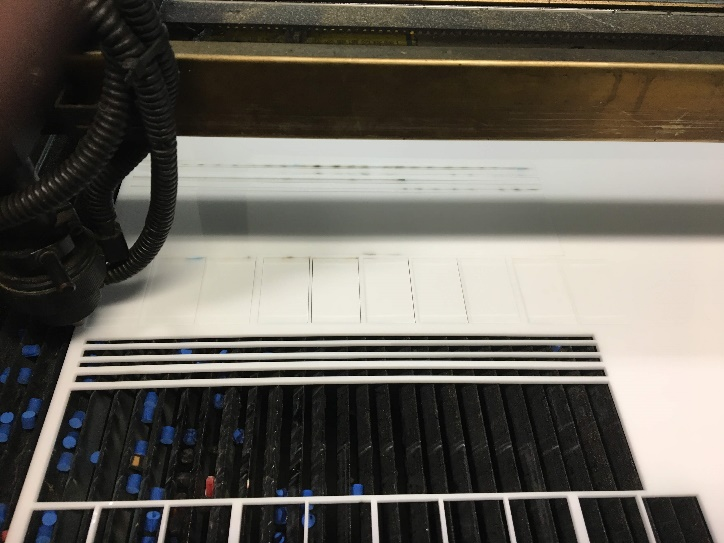
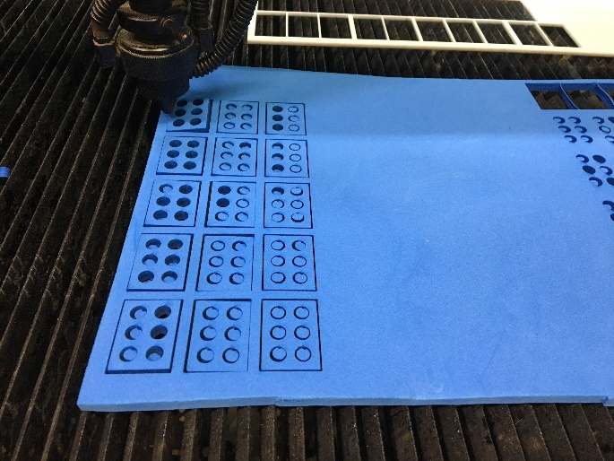
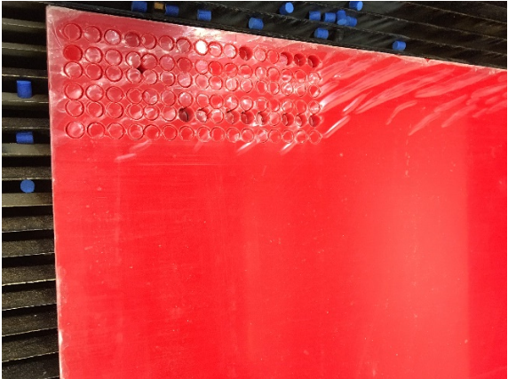
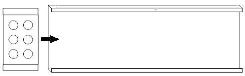
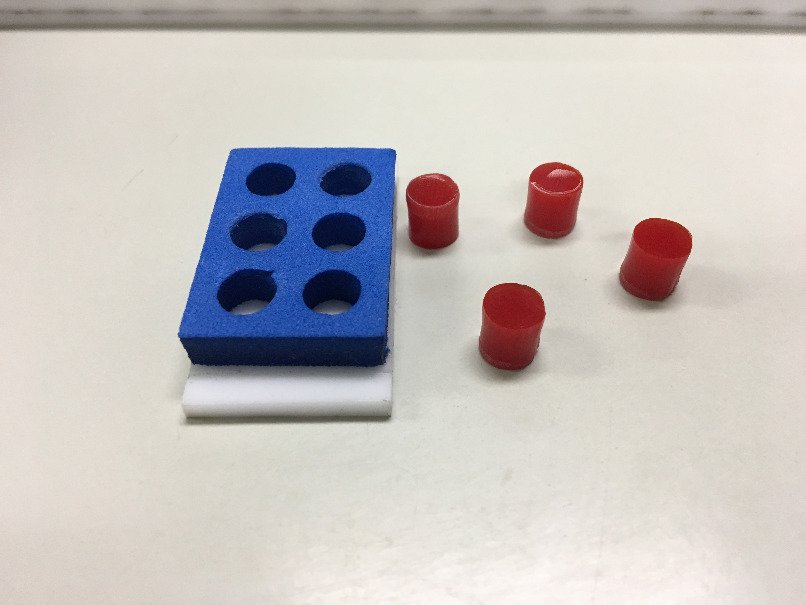
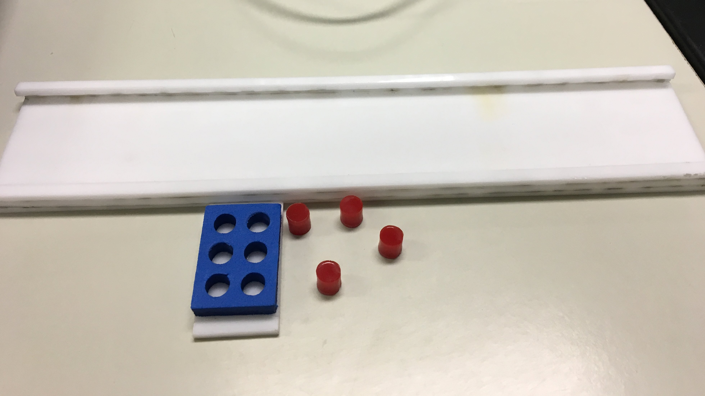
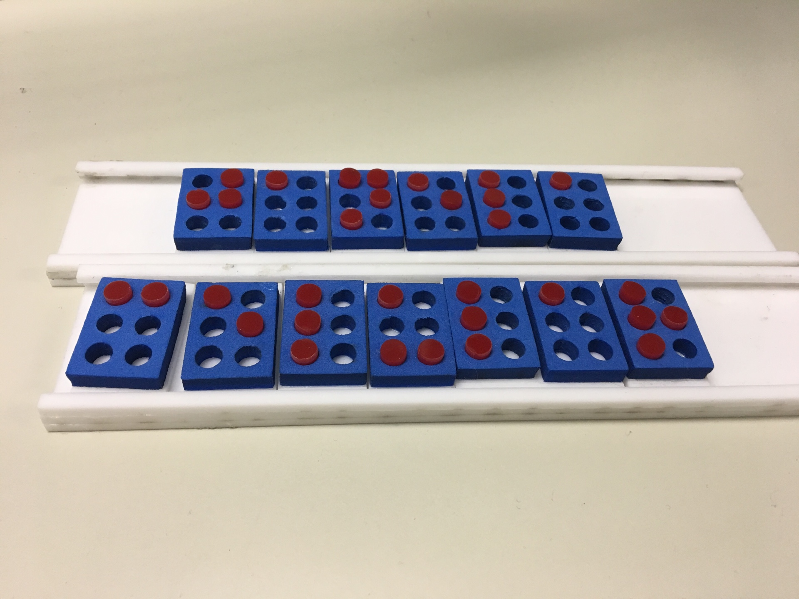

.. _environment:

===============
Building Donnie Robot Environment
===============

Braille Cell Manual
-------------------

Drawing the Parts
~~~~~~~~~~~~~~~

The panels and braille cells production process starts with they being 
drawn in the CAD Corel Draw® software. The drawn pieces can be divided 
in three types:

1. Braille Cells fixation panel

   

2. Braille cell for pin insertion that compose the representation in braille 
   of letters, numbers and symbols.
   

3. Pins that are used for insertion in the braille cells.

Cutting the Parts
~~~~~~~~~~~~~~

The second stage of the production process is the laser cutting. In our production 
we used a laser cutting machine model CMA1080. The cutting of each of the three 
parts can be seen in the images bellow.

1. Braille Cells fixation panel:

   This panel was made with 3mm thick milky white acrylic. Two grooves were made in 
   the edges so the braille cells could move through the fixation panel. This fixation 
   panel can be made as large as necessary, in this case we used the size to support up 
   to ten braille cells.

2. Braille cell for pin insertion that compose the representation in braille of 
   letters, numbers and symbols:

   For the confection of the cell was used a 5mm thick blue EVA (Figure 5b). As the 
   basis of the EVA was used a 3mm thick milky white acrylic (Figure 5a).

3. Pins that are used for insertion in the braille cells:

   These pins were made in a 6mm thick red acrylic. The choice for the red color 
   of the pins and the blue color of the braille cell are due to the ideal contrast 
   for image processing and character recognition.

Assembling the Parts
~~~~~~~~~~~~~~

After cutting the parts in the laser cutting machine it’s possible to assemble the 
fixation panel and the braille cells. The EVA braille cell was glued in the white 
acrylic part (Figure 8). For the panels was made some kind of fitting in order that 
the cells could slip through the fixation panel and that it could also be easily organized. 

 
The result after the fixation panel and the braille cell was assembled is shown below:

Final result!!

