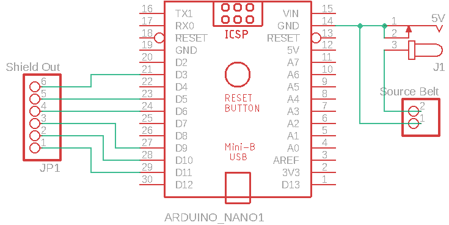
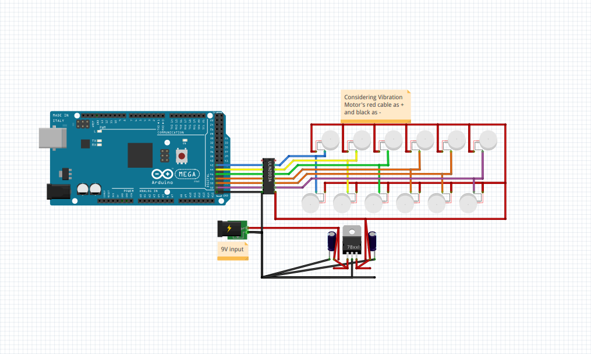
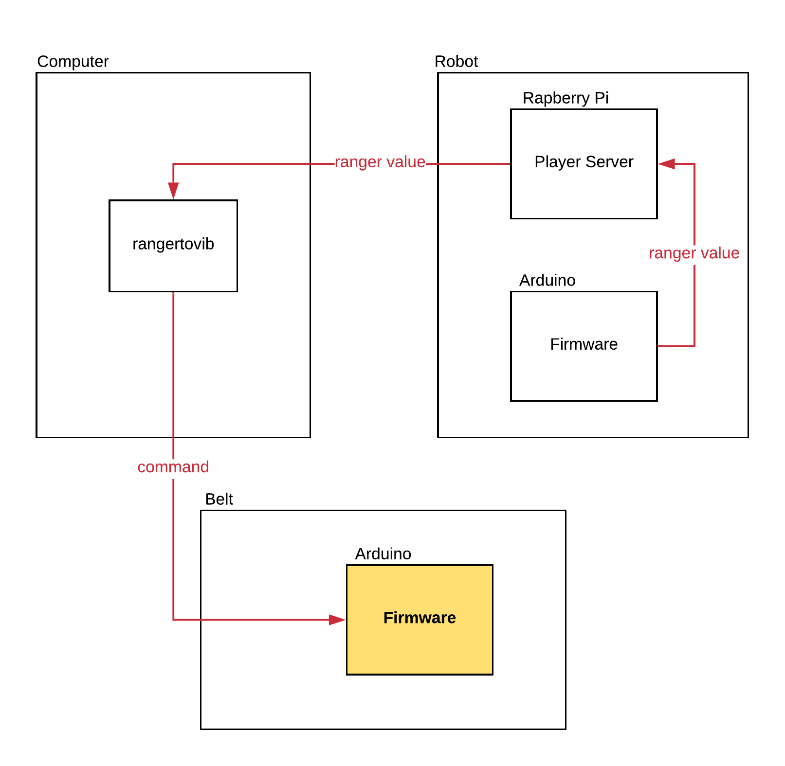
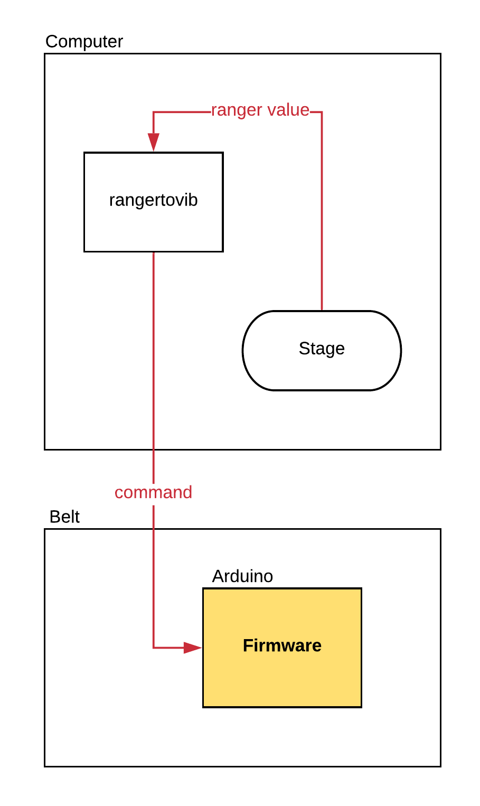

.. _vibbelt:

===============
Building Your Vibrating Belt
===============

Introduction
-------------

With the goal of improving the quality of life of people with visual impairment and helping 
their mobility through a better perception of the environment it was created a tactile belt. 
Capable of working with different intensities, the tactile belt makes the user perceive, 
through vibrations, the approaching of an object.
In this manual there's everything you need to know to build you own vibrating belt. You'll 
learn how to manufacture your belt, how to assembly the parts and how the hardware and the 
firmware work. 

Manufacturing
-------------
The belt hardware basically is composed by 12 haptic motors, an arduino nano, a PCB shield 
and bypass connectors. 

If you want to manufacture the PCB shield you will find all the information you need (PCB design,
schematic, eletrical diagram, BOM file) in the `Vib-belt Repository <https://github.com/lsa-pucrs/donnie-assistive-robot-hw/tree/master/vib-belt>`__.
The PCB schematic is shown in the image bellow.
 

Assembly
-------------
The belt has 2 motor vibracall MV50 modules in each of its 6 columns. These modules have three 
wires connected to them (Gnd, Vcc-5V and the command sign). To connect the wires to the modules 
we recommend that you use bypass connectors. The modules are spaced 10cm of each other in the two 
directions. The image shows exactly how to organize the modules in the belt.

.. image:: ./Belt.png

The image bellow shows how to assembly the parts of the belt. If you prefer, the `Fritzing file <https://github.com/lsa-pucrs/donnie-assistive-robot-hw/blob/master/vib-belt/vib_belt_nano.fzz>`__ 
is also avaliable for you. 

Firmware
-------------

When using physical robot

When using the simulation environment

To make you belt work you'll need to upload the `.ino file <https://github.com/lsa-pucrs/donnie-assistive-robot-sw/blob/devel/firmware/vib_belt/vib_belt_new/vib_belt_new.ino>`__ 
into your arduino.

