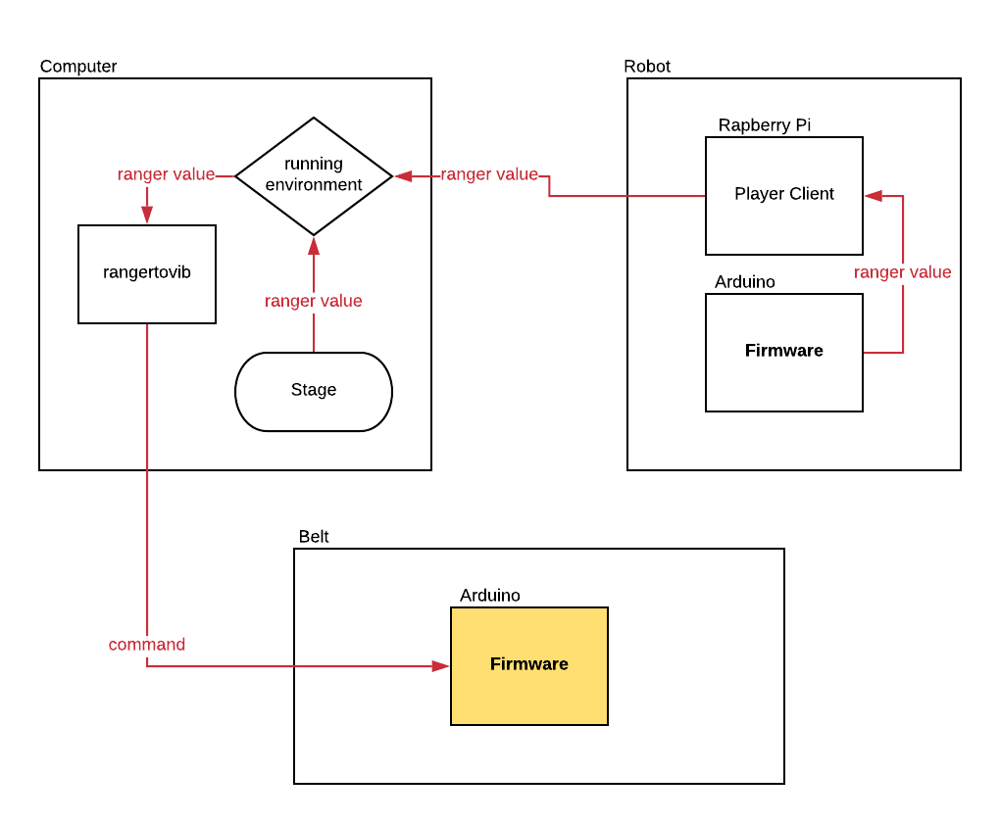

.. _vibbelt:

===============
Building Your Vibrating Belt
===============

Introduction
-------------

With the goal of improving the quality of life of people with visual impairment and helping 
their mobility through a better perception of the environment it was created a tactile belt. 
Capable of working with different intensities, the tactile belt makes the user perceive, 
through vibrations, the approaching of an object.
In this manual there's everything you need to know to build you own vibrating belt. You'll 
learn how to manufacture your belt, how to assembly the parts and how the hardware and the 
firmware work. 

Manufacturing
-------------
The belt hardware basically is composed by 12 haptic motors, an arduino nano, a PCB shield 
and bypass connectors. 

.. image:: ./Belt.png

Assembly
-------------

.. image:: ./vibbelt.png

Firmware
-------------

fazer tipo um tutorial usando os Cfg do Donnie como exemplo

